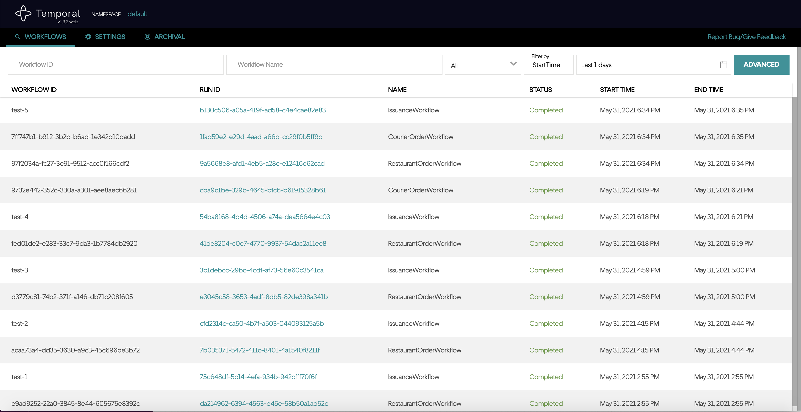

## Prerequisites

Install [docker](https://www.docker.com/get-started)

## Setup

1. Build courier service:

`./gradlew :courier:jibDockerBuild`

2. Build restaurant service:

`./gradlew :restaurant:jibDockerBuild`

3. Build issuance service:

`./gradlew :issuance:jibDockerBuild`

4. Run full stack including temporal:

`docker-compose up`

## Test running workflows



1. Go to issuance service on `http://localhost:8082/graphiql`, and enter the graph query to create an order:

```
mutation {
  fulfillOrder(order: { id: "my-test-order-id-1"}) {
    id
  }
}
```

2. Observe issuance logs has some entry

3. Observe in temporal UI on `http://localhost:8088/namespaces/default/workflows?range=last-1-days` that a workflow is started. Copy the workflow id you see for `RestaurantOrderWorkflow`.

4. Go to restaurant service on `http://localhost:8081/graphiql`, and enter the graph query to make restaurant accept order:

```
mutation {
  acceptOrder(order: { id: "<restaurant_order_workflow_id_from_earlier>"}) {
    id,
    status
  }
}
```

5. Observe restaurant logs has some entry

6. Observe in temporal UI on `http://localhost:8088/namespaces/default/workflows?range=last-1-days` that a new `CourierOrderWorkflow` is started. Copy the workflow id you see for `CourierOrderWorkflow`.

7. Go to restaurant service on `http://localhost:8083/graphiql`, and enter the graph query to make courier accept order:

```
mutation {
  courierAcceptOrder(order: { id: "<courier_order_workflow_id_from_earlier>"}) {
    id,
    status
  }
}
```

8. Observe courier logs has some entry

9. Temporal UI should show master workflow (`IssuanceWorkflow`) and child workflows (`CourierOrderWorkflow` and `RestaurantOrderWorkflow`) are now completed

## Development

1. Kill the service in docker, for example `courier`:

`docker-compose stop courier`

2. Run application manually outside docker:

`./gradlew :courier:bootRun`

## Monitoring for temporal

The local setup is using [grafana](https://grafana.com/) for data visualizaton and [prometheus](https://prometheus.io/) for data collection. In production, we will most likely use DataDog / AWS Cloudwatch Metrics.

Temporal allows customization of metrics endpoints. For this example, we configured temporal's `PROMETHEUS_ENDPOINT`. See the docker-compose.yml file for more details.

After that, the stats can be monitored on `localhost:3000`.

## Running loadtest

1. Install [k6](https://k6.io/)

2. Go to `loadtest/` and run `k6 run loadtest.js`. You may edit the code as you wish
